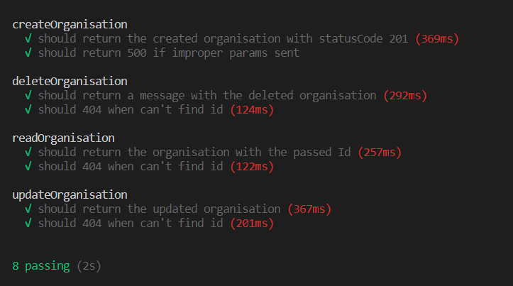
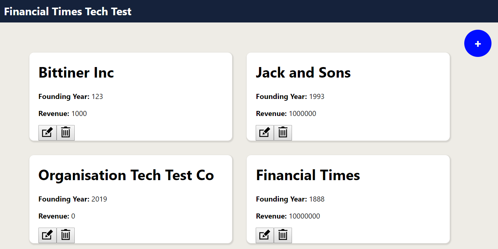
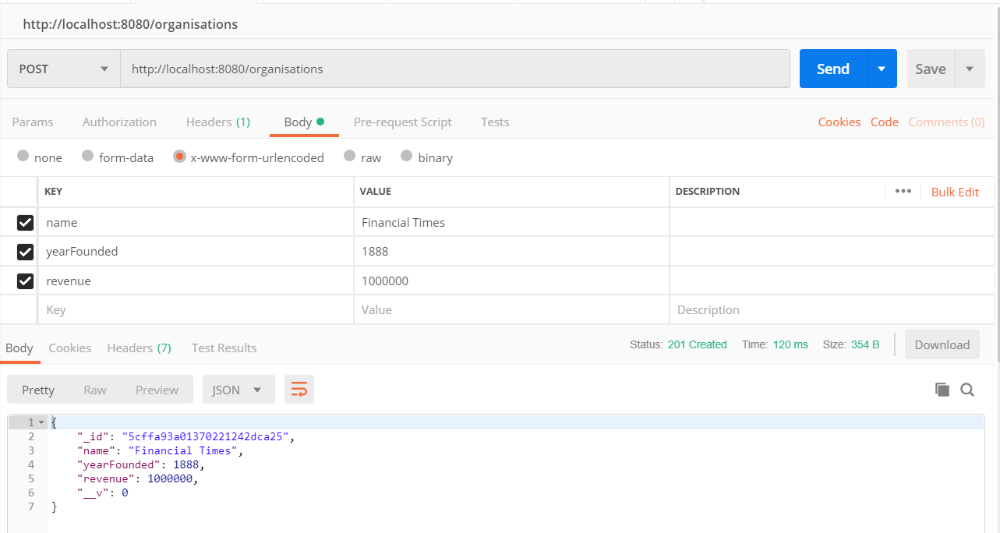

# Organisations

## The Task

An organisation has the following properties:

- Name
- Year founded
- Revenue

Please use Node.js and a database of your choice to create a CRUD API - a set of HTTP endpoints for creating, reading, updating and deleting organisations.

The rest is entirely up to you. :)

## How to Run

#### Install the App

Make sure you have node installed. (I'm using version 10.15.2)

Make sure you have NPM installed. (I'm using version 6.4.1)

```
// clone the repository
git clone git@github.com:jackbittiner/Organisations.git
// enter the repository
cd Organisations
// install the dependencies
npm i
```

#### The Tests

```
// start the test server
npm run test-server
// open a new terminal tab and then run the tests with
npm test
```

You should see the following:



All Green (...hopefully)! Nice!

#### Run the App

```
// make sure you've stopped running the test server
// enter the client
cd client
// install dependencies
npm i
// run the app
npm start
// A browser should load the page automatically but if not navigate to http://localhost:3000/
```

You should then see a page that looks a little something like this:



Feel free to mess about with it. You can create, delete and update organisations. The forms to update and create organisations have validation but I haven't shown validation errors due to running out of time. For the create form, all fields are required and the Year Founded and Revenue fields must be numbers. And for the update form only one field is required.

You can also hit the API using postman. The following shows an example post request:



## Technologies Used

- Node
- MongoDB
- Mongoose
- React

## My Process

So the brief for the test was very short, but also very open ended. I began by creating the CRUD endpoints as this was the only requirement specified. As the API is fairly simple I decided to use supertest for API-level testing and then implemented the rest. I haven't used mongoDB or mongoose before so there was a slight learning curve but thankfully they were simple to pick up.

The tech test then states: `The rest is entirely up to you. :)`

I was unsure of what this meant. So I interpreted it as "Literally do whatever you want to, Jack". So I did a front-end to consume the API. It's nothing particularly fancy and I did it in a bit of a rush. But it was just something to show that I have some React skills somewhere up my sleeves. It also reminded me of how annoying form validation is, but thankfully I discovered Formik and Yup which made it a hell of a lot easier.

## The Good

- It works.
- It's pretty simple.
- Separate databases for tests.

## The Bad

- The front-end design (I'm not a designer and left to my own devices my website always look old and clunky)
- The front end wasn't TDD'd. The reason I didn't TDD the front-end was because I considered it more of a spike. It wasn't required and I had certain time constraints.

## What would I do with more time?

- Create more endpoints for the API. Perhaps a filter by date/revenue.
- Create snapshot tests for the front-end to make sure no future changes (that admittedly won't occur) break the journeys
- Some data visualisation. The data is fairly simple, but I would've liked to have shown something to show my eagerness to your project.

## Thank you

Thank you for taking the time to review this tech test. I hope it's up to scratch and I look forward to hearing from you.
